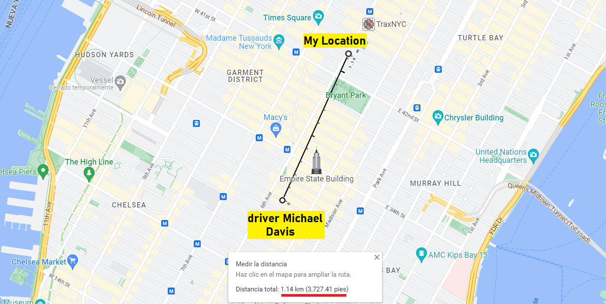
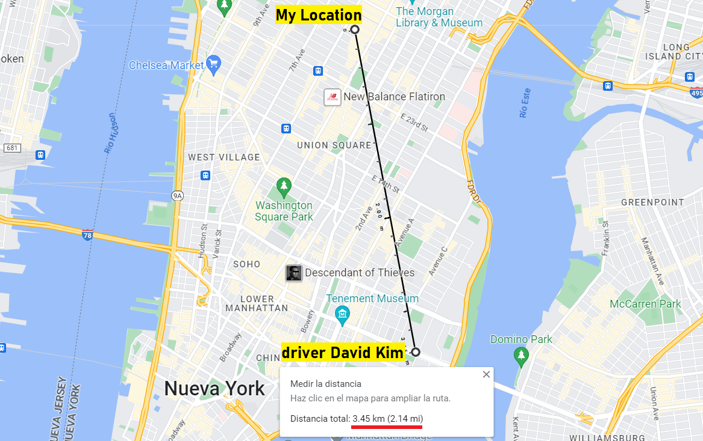

# Taxicabs Locator 🏙🚕
Given the cabs coordinates and it's driver's names in a .JSON file which can be real-time updated, taxi data is uploaded, sorted by distance in km. Project developed in VSCode.

## Step by Step 📑
To begin with, I need the coordinates of some taxicabs in a specific area. I asked the AI language model [ChatGPT](https://chat.openai.com/chat) to fill the `cabsCoords.json` file with the coordinates of seven random taxis around Manhattan, from Central Park to the south, within a 4 km radius. ChatGPT also provided the names of the drivers and gave me my coordinates at the intersection of Broadway and W 30th St.

```json
{
"your_coordinates": {
     "latitude": 40.74682811843807, 
     "longitude": -73.98848619172874 },
"drivers": [
      { "name": "John Smith", "latitude": 40.74771308973833, "longitude": -73.97877709492026 },
      {"..."},
      { "name": "William Wang", "latitude": 40.74083180050023, "longitude": -74.00535973627026 }
    ]
  }
```

Next, I transferred the data into arrays and dictionaries to apply algorithms that calculate the geographic distance in kilometers between my coordinates and the taxis'.

After that, the resulting data is written into the output JSON file and uploaded in ascending order of distance, so that I can easily determine which driver is closest to me.

```json
{
 "taxicabs": [
  { "name": "John Smith", "distance": 0.8238008665967854 },
  { "name": "Michael Davis", "distance": 1.1391259008548733 },
  {"..."},
  { "name": "David Kim", "distance": 3.4481215635639435 }
 ]
}
```
This is how we can determine the distance between the taxis and our current location. Below, you can see that the distances measured in Google Maps match those calculated using the program.





## Haversine Algorithm 🌐
The Haversine Formula allows us to calculate the spherical distance between two points on a spherical surface, given their longitudes and latitudes. After converting the variables to radians and using trigonometric functions from the `math` library, we apply the Haversine Formula.

```python
  dlat = lat2 - lat1
  dlon = lon2 - lon1
  a = sin(dlat/2)**2 + cos(lat1) * cos(lat2) * sin(dlon/2)**2
  c = 2 * asin(sqrt(a))
  r = 6371 # Radius of the Earth in kilometers
  distance = c * r
    
return distance
```


